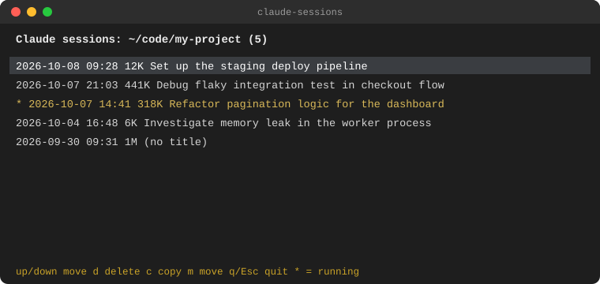
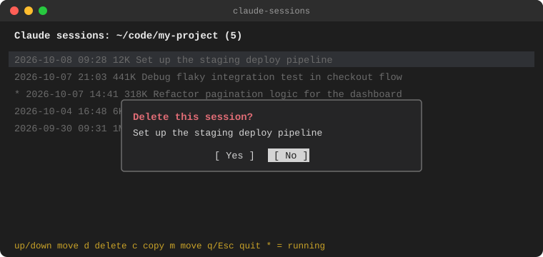
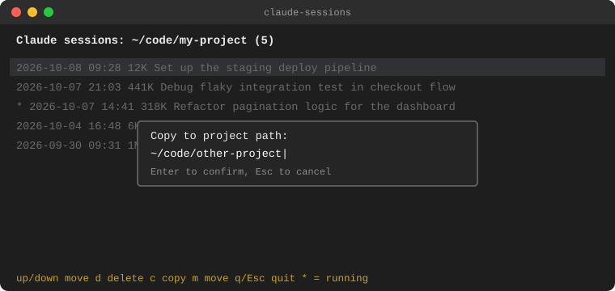
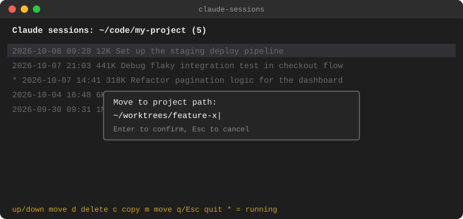

# claude-sessions

[English](README.md)

프로젝트별 Claude Code 세션 기록을 조회, 삭제, 복사, 이동할 수 있는 작은 터미널 UI 도구입니다.

## 기능

- 세션 목록 보기 (제목 · 시각 · 크기)
- 삭제 → 휴지통으로 이동 (복구 가능)
- 복사 / 이동 → 다른 프로젝트 경로로 (git worktree 등에서 대화 이어갈 때 유용)

<table>
<tr>
<td align="center" width="50%"><br><sub>목록 화면</sub></td>
<td align="center" width="50%"><br><sub>삭제 화면</sub></td>
</tr>
<tr>
<td align="center" width="50%"><br><sub>복사 화면</sub></td>
<td align="center" width="50%"><br><sub>이동 화면</sub></td>
</tr>
</table>

## 사용법

```bash
claude-sessions [프로젝트_경로]   # 생략 시 현재 디렉토리
```

| 키                  | 동작                                   |
|---------------------|----------------------------------------|
| `↑`/`k`, `↓`/`j`    | 선택 이동                              |
| `PgUp` / `PgDn`     | 페이지 단위 이동                       |
| `d`                 | 선택한 세션 삭제(휴지통으로)            |
| `c`                 | 세션을 다른 프로젝트 경로로 복사         |
| `m`                 | 세션을 다른 프로젝트 경로로 이동         |
| `q` / `Esc`         | 종료                                    |

## 설치

```bash
chmod +x claude-sessions
ln -s "$PWD/claude-sessions" ~/.local/bin/claude-sessions
```
